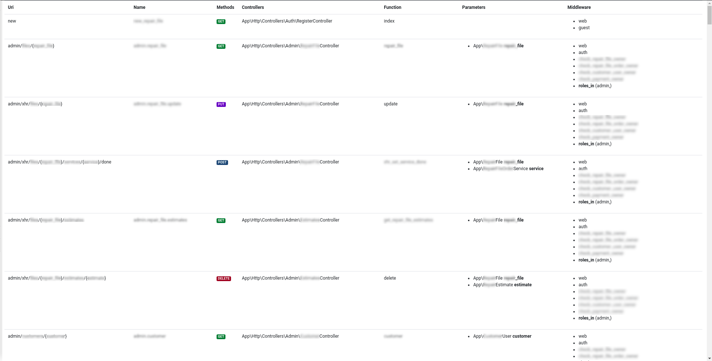

# Laravel Route Summary

[![Latest Version on Packagist][ico-version]][link-packagist]
[![Total Downloads][ico-downloads]][link-downloads]

Create an HTML graphical summary of all the routes of your Laravel project. 



The routes are exported in both Html/Json files where they are represented in the following format:

```json
[
    {
        "uri": "\/",
        "name": "homepage",
        "controller": "App\\Http\\Controllers\\HomeController",
        "controller_method": "index",
        "parameters": [],
        "methods": [
            "GET"
        ],
        "middleware": [
            "web"
        ]
    },
    {
        "uri": "new",
        "name": "new_foo",
        "controller": "App\\Http\\Controllers\\Auth\\RegisterController",
        "controller_method": "index",
        "parameters": [],
        "methods": [
            "GET"
        ],
        "middleware": [
            "web",
            "guest"
        ]
    }
]
```

## Installation

```sh
composer require --dev biscofil/laravel-route-summary
```

## Usage

```sh
php artisan route:summary
```

## Credits

- [Filippo Bisconcin][link-author]
- [All Contributors][link-contributors]

## License

license. Please see the [license file](license) for more information.

[ico-version]: https://img.shields.io/packagist/v/biscofil/laravel_route_summary.svg?style=flat-square
[ico-downloads]: https://img.shields.io/packagist/dt/biscofil/laravel_route_summary.svg?style=flat-square
[ico-travis]: https://api.travis-ci.org/biscofil/laravel_route_summary.svg?style=flat-square
[ico-styleci]: https://styleci.io/repos/12345678/shield

[link-packagist]: https://packagist.org/packages/biscofil/laravel-route-summary
[link-downloads]: https://packagist.org/packages/biscofil/laravel-route-summary
[link-travis]: https://travis-ci.org/biscofil/laravel_route_summary
[link-styleci]: https://styleci.io/repos/12345678
[link-author]: https://github.com/biscofil
[link-contributors]: ../../contributors
